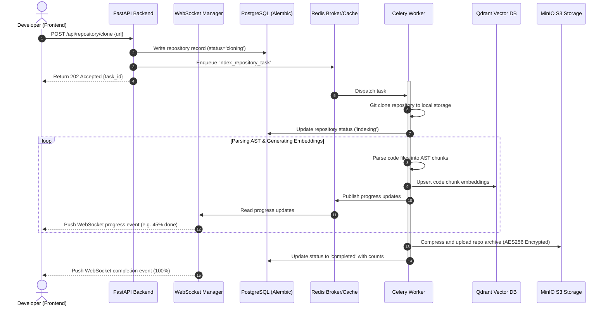

# System Architecture

Codexa (CodePilot AI) is structured as a decoupled, multi-tier microservices architecture. It separates web routing from heavy CPU-bound code analysis tasks, allowing both tiers to scale independently.

---

## 🏗 High-Level Architecture Flow

The following diagram illustrates how user operations (like requesting a repository index) flow through the system:



---

## 🧩 Core Architecture Components

### 1. Web & API Tier (FastAPI Backend)
* **High Concurrency**: Built on `uvicorn` and `anyio` to handle hundreds of concurrent WebSocket connections and API calls.
* **Synchronous & Asynchronous Handlers**: Fast CRUD endpoints use async paths, while CPU-bound and blocking API calls are delegated to the Celery worker pool.
* **Authentication Middleware**: Resolves session authentication via JWT tokens and OAuth2 flows. Validates `sk_live_...` API keys from the HTTP authorization headers on raw routes.

### 2. Distributed Execution Tier (Celery + Redis)
* **Message Broker**: Redis serves as the message broker, queueing jobs safely.
* **Worker Pools**: Concurrency is managed via Celery workers running on isolated containers with persistent workspace disks for Git checkouts.
* **Late Acknowledgement (`acks_late=True`)**: Tasks are only removed from the queue upon successful execution. If a worker container crashes mid-task, Celery automatically re-assigns the job to a healthy worker.

### 3. Database & Caching Tier
* **PostgreSQL**: Stores relational models (Users, Projects, Audit Logs, API keys, Comments, and Repository Metadata). Versioned migrations are managed using **Alembic**.
* **Redis Cache**: Caches LLM prompts and database query responses. Also implements client IP-based token-bucket rate limiters.
  * **Fallback Rate Limiter**: If the Redis server experiences an outage or becomes unavailable, the FastAPI backend automatically falls back to an in-memory client IP rate limiter.
  * **LRU Memory Capping**: The in-memory fallback rate limiter stores request timestamps in an `OrderedDict` acting as a Least Recently Used (LRU) cache, capped at 10,000 unique client IP-category combinations. This bounds memory consumption and prevents denial-of-service memory-leak vectors.
  * **Fallback Metrics**: Fallback activation is monitored via the Prometheus counter `codepilot_ai_rate_limit_fallback_total`.
* **Qdrant Vector Database**: Indexes code-chunk embeddings for high-dimensional semantic search.

### 4. Storage & Security Tier (MinIO S3)
* **Source Archiving**: Cloned repositories are archived into `.zip` files and pushed to S3 object storage.
* **Server-Side Encryption (SSE)**: S3 uploads enforce `AES256` encryption at rest.
* **Metadata Integrity**: Each upload verifies a `sha256` payload checksum before accepting changes.

---

## 📊 Observability & Monitoring Infrastructure

```text
  ┌──────────────────────────────────────────────────────────┐
  │                   FastAPI / Celery Workers               │
  │   [FastAPI Instrumentator]     [OpenTelemetry SDK]       │
  └───────────┬─────────────────────────────┬────────────────┘
              │                             │ (OTLP Spans)
              │ (Scrape /metrics)           ▼
              │                    ┌─────────────────┐
              ▼                    │ OTEL Collector  │
       ┌─────────────┐             └────────┬────────┘
       │ Prometheus  │                      │
       └──────┬──────┘                      │ (OTLP Logs)
              │                             ▼
              │                      ┌─────────────┐
              │                      │ Grafana     │
              │                      │ Loki        │
              │                      └──────┬──────┘
              │                             │
              ▼                             ▼
       ┌───────────────────────────────────────────┐
       │             Grafana Dashboards            │
       └───────────────────────────────────────────┘
```

* **FastAPI Instrumentator**: Exposes system metrics (CPU utilization, HTTP request counts, response latency histograms) at `/metrics`.
* **OpenTelemetry (OTEL) SDK**: Instrumentations are attached to `psycopg2` (DB connection pool), `redis`, and `celery` to track spans across database calls and asynchronous worker pipelines.
* **Promtail**: A log shipper agent that mounts the Docker daemon socket (`/var/run/docker.sock`), reads stdout/stderr logs from all containers, and forwards them to Loki.
* **Grafana Loki**: Log aggregation system displaying live container logs.
* **Grafana**: Visualizes system state through an auto-provisioned dashboard (`observability/grafana/provisioning/dashboards/codepilot.json`).
